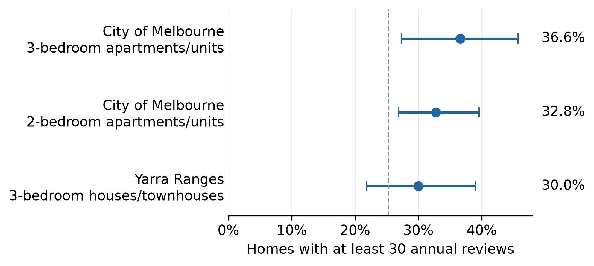
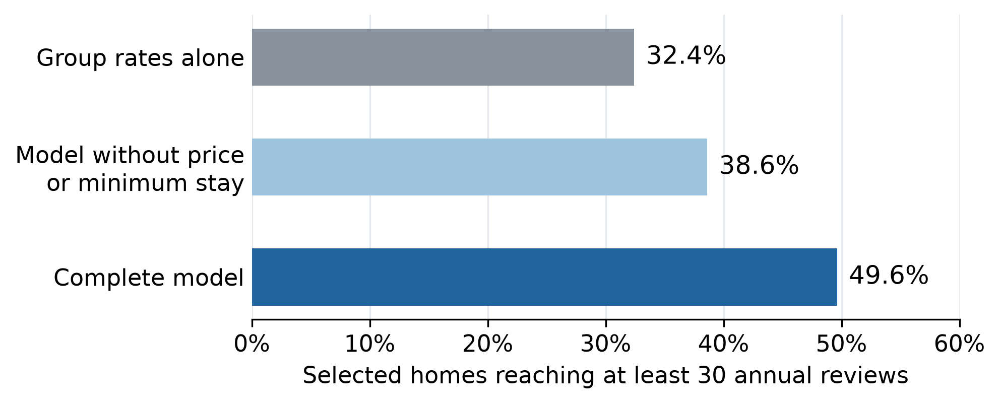
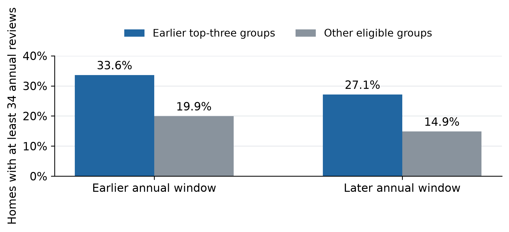
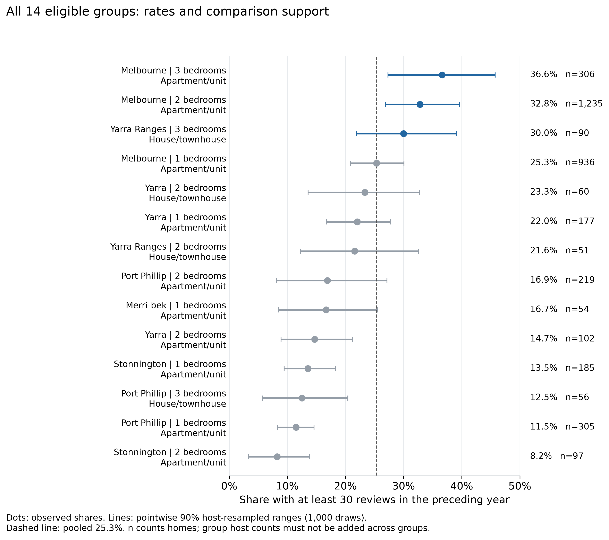

# Melbourne Airbnb Market Screening

CMCE30005 Final Project Report | TheNextChapter Group 2

Eric Huang, Loc Le, Qihang Sun and Maksym Xu

## Current final report reviewed 4 October 2026

[Final report PDF](final-report/report-2026-10-04/Final_Report.pdf) · [Word](final-report/report-2026-10-04/Final_Report.docx) · [Matching report text](final-report/report-2026-10-04/Final_Report.md) · [Files and checks](final-report/report-2026-10-04/README.md)

The complete current report follows. Its analysis is pinned to revision e4c68ca. This report release changes writing, report charts and repository navigation; it does not change the analysis results, presentation or archived interim submission.

## 1. Introduction

Our client plans to rent residential properties and offer short stays through Airbnb. Choosing a property means committing to rent and setup costs before knowing how much guest income it will generate. With limited startup funds, the client needs to decide where to look and which homes deserve a closer inspection.

We use the Melbourne Inside Airbnb dataset supplied through the subject LMS to help make these choices. Dated guest reviews provide a record of past guest activity. We compare this activity across property groups, then test whether a simple model helps select homes within the most promising groups.

We recommend starting with two- and three-bedroom apartments in the City of Melbourne. Three-bedroom houses and townhouses in Yarra Ranges offer another search option. Within these groups, 49.6% of homes selected by the model reach at least 30 annual reviews on average, compared with 32.4% using group rates alone. We explain how the client can use these findings to organise a search and assess candidates before signing a lease.

## 2. Problem Definition and Objectives

The client faces two decisions. First, which parts of the market deserve attention? Second, how should the client narrow the list of properties found there? We address them through two research questions:

1. Which property groups have the strongest historical guest-review activity?
2. Does information about individual homes improve selection beyond each group's historical rate?

A group combines council area, dwelling type and bedroom count. Our analysis covers standard entire homes with one to three bedrooms and at least one year of recorded review history. We define high review activity as at least 30 reviews in the preceding 365 days. This threshold comes from the upper quarter of a separate reference sample.

Since the interim report, we have replaced the more complex model with logistic regression and added 50 repeated comparisons, including tests within the three priority groups. All completed analysis uses the supplied dataset.

## 3. Data Description and Preparation

The dataset contains 25,728 listings collected between 17 June and 1 July 2026 (Inside Airbnb, 2026). We match property details to dated reviews and count reviews in the 365 days before each property's collection date. Calendar availability cannot separate bookings from dates blocked by the host, so we use dated reviews to measure recorded guest activity.

We keep entire rental units, condos, homes and townhouses with one to three bedrooms. We combine rental units and condos as apartments/units, and homes and townhouses as houses/townhouses. These types fit the client's leasing business. Homes need a quoted nightly price of AUD30-1,500 and a first review at least 365 days before collection. The price range is an initial analysis boundary; the history rule provides a longer review record.

We set aside reference hosts before modelling, dividing the 6,891 eligible homes into 5,549 analysis homes and 1,342 reference homes. Keeping groups with at least 50 analysis homes provides a minimum base for comparison. Table 1 shows the sample.

**Table 1. How the comparison sample is formed**

| Population | Listings |
|---|---:|
| Supplied snapshot | 25,728 |
| Entire homes with one to three bedrooms | 16,576 |
| Four standard dwelling types | 14,895 |
| Eligible prices and review history | 6,891 |
| Analysis population before minimum group size | 5,549 |
| Final analysis sample in 14 groups | 3,873 |
| Separate reference population before group restriction | 1,342 |
| Reference within the same 14 groups | 906 |

The final comparison uses 3,873 homes from 1,726 hosts across six council areas. About 64% are in the City of Melbourne. The median home has 15 annual reviews, and 334 homes, or 8.6%, have none. Keeping these zero-review homes makes quieter listings part of the comparison.

The 906 reference homes give an upper-quarter cutoff of 29.75 reviews, rounded up to 30. Their hosts stay outside model training and testing. Missing-value treatment and category coding use training data only. Three homes lack minimum-stay values, so their derived one-night acceptance category uses the most common training category. Appendix A gives the preparation details.

## 4. Methodology

We begin with a straightforward comparison: what share of homes in each group reach 30 annual reviews? We also resample hosts and recalculate the shares to show how much the results vary. Each host's properties stay together because they can share management practices.

For individual homes, we use logistic regression in R (R Core Team, n.d.). It suits our two possible outcomes: a home either reaches 30 reviews or falls below that level. The model learns weights from training homes for six inputs: council area, dwelling type, bedrooms, price compared with similar homes, acceptance of one-night stays and number of amenities. It adds their weighted contributions to form a ranking score. Across the 50 fits, lower relative prices, one-night acceptance and more amenities raise the score when other inputs stay the same. Higher-scoring homes come earlier in the investigation list.

The group-rate baseline uses each group's training rate, adjusted towards the overall training rate. Homes in the same group receive the same score, leaving them equally ranked. We also test a reduced model without price and minimum-stay information to measure how much those two inputs add together.

We test the methods 50 times. Each time, 70% of hosts provide training homes and the remaining 30% provide test homes. Homes from the same host always stay on the same side. All methods see the same test homes and select the same number for investigation.

Our main test selects 25% of homes separately within each priority group, asking whether the model helps once the search areas are decided. We average the selected homes' target rate over 50 tests. Trying 10% and 50% lists shows the effect of changing investigation capacity. Appendix A explains rounding and equal treatment of tied scores.

Finally, we reconstruct two annual review windows from the same snapshot for homes with longer histories. We identify the earlier leading groups and check their performance in the later year. That comparison uses its own 34-review target, set from the earlier reference window.

## 5. Analysis and Results

### 5.1 City apartments provide a clear starting point

Across the full analysis sample, 981 of 3,873 homes reach 30 annual reviews, or 25.3%. Group rates range from 8.2% to 36.6%. A single average would hide these differences.

City of Melbourne three-bedroom apartments have the highest observed rate: 112 of 306 homes reach the target, or 36.6%. Two-bedroom apartments follow at 32.8%, with 405 of 1,235 homes qualifying. Yarra Ranges three-bedroom houses and townhouses reach 30.0%, or 27 of 90 homes. The two city groups combine stronger observed activity with larger samples, making them our first search priority.



**Figure 1.** Homes reaching at least 30 annual reviews. Horizontal lines show 90% ranges from resampling hosts; the dashed line marks the overall 25.3%. Appendix B shows all 14 groups.

The same three groups remain when the minimum size is 30 or 75 homes, or when we remove the price or history restriction. Broader rules can swap second and third place. The useful result is the shortlist of three groups. Specialised accommodation changes that list, so we keep the residential scope that matches the client's search.

### 5.2 The model helps narrow the list within these groups

Choosing a group still leaves many homes to investigate. The complete model helps with this next decision. When each method selects 25% within each priority group, the selected homes' average historical target rate is 49.6% for the complete model, 38.6% for the reduced model and 32.4% for the group-rate baseline.

The complete model's gain is 17.2 percentage points. In practical terms, a list of 100 selected homes contains about 17 more homes with at least 30 annual reviews than a list selected using group rates alone. The model improves the concentration of past guest activity in the investigation list.



**Figure 2.** Average historical target rates over 50 tests. Each method selects 25% within each priority group. The reduced model leaves out price and minimum-stay information.

The complete model beats the baseline in 46 of the 50 tests and falls behind in four. This is a strong reason to use it as an additional screening tool once the client has chosen the search groups.

Price and minimum-stay information make a substantial difference. Including them raises the average selected rate by 11.0 percentage points over the reduced model. Within a fixed group, the reduced model can distinguish homes only by amenity count. In City of Melbourne three-bedroom apartments, its rate is 33.9%, below the baseline's 35.9%. Our recommendation is therefore to use the complete model for homes with comparable operating information. Group comparisons provide the starting point when that information is unavailable.

### 5.3 Investigation capacity changes what the client finds

A smaller list concentrates attention on homes with stronger historical activity. A larger list finds more of the homes that reach the target. Table 2 shows this trade-off for the complete model within the three priority groups.

**Table 2. Results at different investigation capacities**

| Share investigated in each group | Share of selected homes reaching 30 reviews | Share of all qualifying homes found |
|---|---:|---:|
| 10% | 54.5% | 17.1% |
| 25% | 49.6% | 38.3% |
| 50% | 43.1% | 66.7% |

Values are averages over the 50 tests. At 10% capacity, more than half the selected homes reach the target, but the list finds only 17.1% of all qualifying homes in these groups. At 50%, it finds about two-thirds. The model improves on the baseline at every tested capacity on average, by 22.0, 17.2 and 10.7 percentage points respectively.

We recommend a 25% list as a starting point for planning. Widen it if too few homes meet the client's practical requirements. The right list size depends on the time available for inspections and checks.

### 5.4 Earlier leading groups stay ahead in the following year

The two-year comparison follows 2,657 homes across ten groups. At the fixed 34-review target, 27.1% of homes in the earlier top-three groups qualify in the later year, compared with 14.9% elsewhere. They retain an advantage of around 12 percentage points.



**Figure 3.** The same homes are compared in both years. The earlier leading groups remain ahead, although their qualifying share falls from 33.6% to 27.1%.

The earlier leaders stay ahead as activity falls. Keep them on the search list and check current conditions for each property.

## 6. Key Findings and Recommendations

Search City of Melbourne two- and three-bedroom apartments first. Consider Yarra Ranges three-bedroom houses and townhouses when city homes have unsuitable lease terms or limited availability.

Rank comparable established homes with the complete model using consistent price, minimum-stay and amenity information. For new rental candidates, label proposed settings and confirm them during investigation.

Before signing, confirm permitted short-stay use in writing and obtain rent, setup and operating cost quotes. Assess achievable nightly rates and paid nights. Proceed when the expected and downside cash flows meet the client's agreed return and cash-buffer requirements.

**Table 3. Proposed first investigation round**

| Timing and owner | Action | Decision condition |
|---|---|---|
| Week 1 operator | Find ten candidates across the priority groups | Confirm availability and property scope |
| Weeks 2 and 3 operator and analyst | Check permissions, obtain quotes and assess guest demand | Keep incomplete cases pending and reject homes that fail requirements |
| Week 4 client | Compare the qualified homes and their cash-flow estimates | Proceed when downside cash flow and cash-buffer requirements are met |
| Operating trial operator | Record paid nights, workload and net cash flow | Review actual results before expanding |

Ten candidates and 30 days are suggested planning limits. Extend the search when needed, and leave unsuitable leases unsigned. If practical testing finds little benefit from the model, use group rates as the main guide.

## 7. Limitations and Future Work

The findings support a focused search. Profitability still depends on paid nights, stay length and costs, which reviews do not measure directly. A trial should record these outcomes alongside review activity.

Our sample covers established homes in selected areas. A first review shows the length of the review record, and continuous operation remains unknown. The next coverage check should include new entrants and other areas. Leaving price out of the model also leaves the original price-filtered sample unchanged.

Price and minimum-stay settings were recorded at collection and can reflect earlier performance. Their combined contribution supports screening with that information; the effect of changing either setting needs a separate prospective test.

The next validation should freeze the chosen groups, model and selection rule before testing newly observed outcomes. The current 50 comparisons reuse records and follow earlier exploration. We should also check how well scores match observed rates before presenting them as individual probabilities. Appendix A records the uncertainty in the published comparisons.

## 8. References

Inside Airbnb. (2026). *Melbourne listings and dated reviews* [Dataset supplied through CMCE30005 LMS, collected 17 June-1 July 2026].

R Core Team. (n.d.). *Fitting generalized linear models glm*. [R documentation](https://stat.ethz.ch/R-manual/R-devel/library/stats/html/glm.html).

TheNextChapter. (2026). *Project analysis and screening follow-up*, revision e4c68ca. [Frozen analysis repository](https://github.com/maksym-xu/CMCE30005-TheNextChapter/tree/e4c68cae863e35bd1e7df0af4738c41b589f0bad).

OpenAI. (2026). *ChatGPT assistance with project planning, interpretation, drafting and editing* [Project-specific generative AI outputs].

Anthropic. (2026). *Claude Code assistance with analysis-code development* [Project-specific generative AI outputs].

### AI acknowledgement

The group used ChatGPT for planning, interpreting results, drafting and editing, and Claude Code for analysis-code development. The group reviewed AI-assisted text and code. Numerical results come from analysis of the supplied dataset. The group remains responsible for the submission.

## Appendix A. Model specification and comparison evidence

The complete model uses unpenalised logistic regression. Area, dwelling type, bedrooms and one-night acceptance are categorical. Reference levels are Melbourne, apartment/unit, one bedroom and no one-night acceptance. Relative price is `(price / training group median - 1) * 10`; amenities are divided by ten. Training modes fill missing acceptance categories, and the overall training median covers an unseen price group. The baseline is `(group positives + 10 * overall positive share) / (group count + 10)`. The reduced model retains area, dwelling type, bedrooms and amenities and is refitted on each training set. All 50 reduced fits converge without warnings.

**Table A1. Separate evaluation designs at 25 percent capacity**

| Evaluation | Complete model | Baseline | Gain in percentage points |
|---|---:|---:|---:|
| Pooled five-fold all eligible homes | 43.65% | 28.07% | 15.58 |
| Mean of 50 allocations all eligible homes | 43.42% | 31.96% | 11.46 |
| Mean of 50 allocations three groups in one pool | 48.91% | 32.37% | 16.54 |
| Mean of 50 allocations separate group quotas | 49.62% | 32.43% | 17.19 |

Five-fold evaluation gives each home one held-out score. Its 969 model selections include 423 reaching target and 546 below, with another 558 target-reaching homes outside the list. Repeated tests reuse saved full-model scores. Rates combine counts within each allocation before averaging allocations equally. Separate group rounding changes total capacity slightly relative to pooling. Methods have equal quotas within each comparison. Quotas round upward and tied scores share boundary places equally without using outcomes. Tied selections contribute expected counts.

Within separate group quotas, complete-model gains average 16.37 points in Melbourne two-bedroom apartments, 17.60 in three-bedroom apartments and 24.99 in Yarra Ranges houses/townhouses. Reduced-model gains are 7.21, -2.05 and 19.35 points respectively. At 25%, the complete model captures 38.29% of target-reaching homes. Its gain over the reduced model is positive in 42 allocations and negative in eight. The middle 90% of paired full-versus-baseline gains span -0.7 to 31.8 percentage points. These percentiles describe allocation sensitivity across overlapping samples.

For all eligible homes, mean AUC is 0.7084 versus 0.6035, improving in all 50 allocations. AUC measures ranking discrimination. Mean Brier score, squared probability error, is 0.17151 versus 0.18406, improving in 44. The five-fold, repeated full-population and priority-group results answer different comparisons.

The later-year gap is 12.3 percentage points using unrounded rates, with a conditional 95% range of 5.1-20.1 points. The exact earlier top-three set returns in 51.5% of host resamples. The range holds candidates fixed; reselecting them gives 5.4-20.2 points. Group ranges are pointwise 90%. All ranges hold the eligibility rules and review thresholds fixed.

Data and group checks are in `reports/tables` and `final-presentation/analysis/reference`, which also contains `temporal-validation`. Model results and source scripts are in `final-report/paired-analysis-2026-10-02` and `final-report/screening-followup-2026-10-03`. The published verifier reconstructs scores and metrics without refitting coefficients or rebuilding raw reviews.

## Appendix B. Full group comparison



**Figure B1.** All eligible groups, listing counts and pointwise 90% ranges from resampling hosts. Leading and lower-performing groups are shown.

## Presentation and analytical evidence

## Final presentation released 1 October 2026

The [final presentation package](final-presentation/README.md) contains the 10-slide PowerPoint, speaking script, updated analysis code and aggregate results. The [evidence map](final-presentation/EVIDENCE_MAP.md) links each slide to its supporting files and explains the limits of the checks.

The final main model is logistic regression for clearer explanation; random forest remains a benchmark. The client is framed as planning to lease homes. The interim report below is retained as the historical version, including its earlier model selection and wording.

## Final report screening evidence updated 3 October 2026

The [final report evidence guide](final-report/README.md) links the paired model comparison and the new [screening follow-up](final-report/screening-followup-2026-10-03/README.md). The follow-up tests selection within the three priority groups, the joint contribution of price and minimum-stay information, and 10%, 25% and 50% shortlist quotas on the same 50 host splits.

With a separate 25% quota inside each priority group, the full model averaged 49.62% historical review-target attainment against 32.43% for the group-rate baseline, a 17.19-point gain. It was better in 46 splits and worse in four. The package includes an English findings brief, figures, aggregate results, reproducible code and independent score and metric checks. These exploratory historical results remain distinct from the original five-fold presentation result and do not establish future profit.

<details>
<summary>Archived interim report and its original reproduction instructions</summary>

## Archived interim report

Interim Project Report

CMCE30005 Business Analytics Challenge | Semester 2 2026 | TheNextChapter Group 2

Eric Huang, Loc Le, Qihang Sun and Maksym Xu

Repository: https://github.com/maksym-xu/CMCE30005-TheNextChapter

## Introduction

Our client leases residential properties and runs them as Airbnb accommodation ("rental arbitrage"), which needs lease and council permission. With limited start-up funds, the client must choose which Melbourne areas and property types to investigate before signing leases; a poor choice ties up money.

We use the Inside Airbnb Melbourne snapshot of June 2026 supplied through the subject's LMS (Inside Airbnb, 2026): property details, locations and dated guest reviews. Dated reviews are a countable record of past guest activity; the calendar cannot separate bookings from host-blocked dates.

The shortlist helps the client decide where to spend limited search and due-diligence time before seeking lease quotations.

## Problem Definition and Objectives

Research questions: (1) Which Melbourne property segments, defined by council area (LGA), apartment or house, and number of bedrooms, show the strongest historical guest-review activity? (2) Can listing attributes improve prediction of high review activity beyond segment averages? "High" means at least 30 reviews in the year before the data were collected, the top quarter of a separate reference group of comparable listings.

Hypotheses: (H1) segments differ materially in the share of listings reaching that level; (H2) a model using listing attributes ranks listings better than the segment average alone.

Objectives: a segment comparison table, a model-versus-average test and a shortlist with ranges.

We study entire homes with one to three bedrooms (1–3BR), what a small operator can furnish and let whole; rental units and condos are the apartment group, homes and townhouses the house group. Each segment needs at least 50 listings as minimum comparison support; quoted prices of AUD 30–1,500 are an exploratory boundary; and a first review at least 365 days before collection gives at least one year of observable review history, not proof of continuous operation.

We call the share of listings reaching 30 reviews (at least 30 reviewed stays) "attainment". Attainment measures review activity, not bookings, occupancy or profit. For an operator paying fixed rent, the main risk is a property that attracts few stays; segments where more comparable listings reach high review activity show such demand is achievable.

## Data Description

The dataset contains 25,728 listings and 1,026,690 reviews, collected between 17 June and 1 July 2026. Its modelled occupancy and revenue fields are built from price, minimum stay and review counts, so ranking on them would reproduce that construction; we rank on review counts.

Cleaning converts price text to numbers and extracts bathroom and amenity counts; price is missing for 6,553 listings and bedrooms for 4,679. The supplied last-12-months review field spans 366 dates, so we rebuilt counts over exactly 365 days from review dates (Table 1).

Table 1. Sample funnel

| Stage | Listings |
| ---------------------------------------- | ---------- |
| All listings in the dataset | 25,728 |
| Entire homes, 1–3 bedrooms | 16,576 |
| Standard dwelling types | 14,895 |
| Quoted price AUD 30–1,500 | 11,099 |
| First review ≥ 365 days before collection | 6,891 |
| Analysis sample (50+ per segment, reference hosts excluded) | 3,873 |
| Reference group (separate, from the 6,891) | 906 |

The reference group's 75th percentile, 29.75 reviews, gives a threshold of 30. The analysis sample (3,873 listings from 1,726 hosts) has 14 segments across six LGAs, about 64% in Melbourne LGA, and keeps 334 listings with zero annual reviews. Overall, 981 listings (25.33%) reach the threshold, and attainment ranges from 8.25% to 36.60% across segments (Figure 1).


Of the 6,801 listings with no usable price (missing or outside AUD 30–1,500), 82% had no review last year: the priced sample is the more active part of the market. Listings that left Airbnb before collection are absent, limiting generalisation to new entrants.

## Methodology and Analytical Approach

A fixed rule on host identifiers sets aside about 20% of hosts as the reference group that defines the 30-review target; they are excluded from all training and testing. We use five-fold validation, each part tested in turn on a model trained on the other four, with each host's properties kept in one fold so a host with many near-identical apartments cannot sit in both training and test data (scikit-learn developers, n.d.). Missing-value treatment and category encoding are learned from training data only.

Logistic regression is the reference; random forest and gradient boosting capture nonlinear patterns. Basic features are location, configuration, capacity, bathrooms and amenity count; an enhanced set adds coordinates, beds and nine amenities. We compare six variants, with and without probability calibration and with and without current price and minimum stay. Review-based predictors, ratings and host badges are excluded.

Every model is compared with a segment-average baseline: each listing gets its segment's training-host attainment. AUC is how well the model orders listings that reach the target above those that do not; 0.5 is a coin toss. Average precision summarises precision across prediction thresholds. Brier score is how far its percentages are from what happened; lower is better. R handles cleaning and tables; Python (scikit-learn 1.7.2) runs the models.

Because candidates were compared after seeing fold results, selection is repeated in a nested check where models are selected using only each outer training fold; property details may have changed during the outcome year.

## Analysis Plan and Progress to Date

Following Week 5 feedback, we dropped the earlier rent-versus-revenue (ROI) design, which needed external rental data.

Table 2. Predictive performance

| Predictor | AUC | Average precision | Brier score |
| --- | --- | --- | --- |
| Segment average (training hosts) | 0.581 | 0.285 | 0.1868 |
| Basic property-only logistic | 0.573 | 0.285 | 0.1886 |
| Enhanced property-only random forest | 0.640 | 0.350 | 0.1813 |

The enhanced random forest beats the segment average in all five folds and, across 20 further host splits on AUC every time and on Brier in 16. A nested check that re-selects the model inside each outer training fold chooses the forest every time: AUC +0.059 (host-resampled 95% range +0.02 to +0.10), Brier −0.0055 (−0.010 to −0.001). Across five probability bins, predicted and observed rates differ by about two percentage points.

Table 3. Initial search candidates (host-grouped forest predictions)

| Segment | Listings / hosts | Observed attainment | Predicted probability | 95% range |
| ---------------------------- | ------------ | ------------ | ------------ | ------------ |
| Melbourne 3BR apartments | 306 / 139 | 36.60% | 34.45% | 33.0–35.8% |
| Melbourne 2BR apartments | 1,235 / 482 | 32.79% | 31.41% | 29.6–33.0% |
| Yarra Ranges 3BR houses/townhouses | 90 / 77 | 30.00% | 27.82% | 26.1–29.3% |

All reported host-resampled ranges hold predictions fixed and exclude refitting, selection and threshold uncertainty; Table 3's are much narrower than Figure 1's observed-rate ranges. Descriptive evidence supports H1: segments differ (8.25% to 36.60%), though neighbours overlap. H2 is supported by nested host-grouped validation on ranking metrics: the model improves overall listing-level prediction but leaves the shortlist unchanged. Segment rates guide the search; the model provides a supplementary historical score for individual listings (within-segment AUC 0.555). Descriptively, the same three segments lead under support rules of 30, 50 and 75 listings, without the history or price rule, and at review targets of 25, 30, 34 and 35 (the top two swap at 34 and 35); the forest's top three recur in 19 of 20 host splits.

An out-of-time check (2,657 listings, 1,208 hosts, 10 segments) uses two non-overlapping 365-day windows and a 34-review target set from the reference hosts' earlier window. The earlier year's top three segments reached it in 27.1% of listings the following year against 14.9% elsewhere, a 12.3-point lead (host-resampled 95% range 5.1–20.1); the exact top-three set recurred in 51.5% of resamples: a persisting historical advantage, not a new operator's profit.

Before signing, the client must verify permissions, rent, costs and availability.

Remaining work:

1. Refit the fixed forest and re-rank under wider property-type and history rules: Eric Huang (modelling lead) and Maksym Xu (data lead), Weeks 9–10 (by 2 Oct).
2. One-page client brief with search priorities and pre-lease checklist: Loc Le (report lead), Week 11 (by 13 Oct).
3. Final report and presentation: all, Qihang Sun coordinating, Weeks 11–12.

If the gain does not persist under wider rules, segment rates remain the main screening tool; if rankings change, we present a broader candidate set.


## References

Inside Airbnb. (2026). Melbourne listings, calendar and reviews [June 2026 dataset supplied through CMCE30005 LMS].

Scikit-learn developers. (n.d.). Cross-validation and probability calibration. https://scikit-learn.org/stable/modules/cross_validation.html

OpenAI. (2026). ChatGPT/Codex assistance with project planning, report drafting and code review [Generative AI outputs, September 2026].

Anthropic. (2026). Claude Code assistance with analysis-code development [Generative AI outputs, September 2026].

## AI Use Acknowledgement

The business problem, research questions, scope rules, choice of methods, data decisions and interpretation of results are the group's own. We used OpenAI ChatGPT/Codex and Anthropic Claude Code to polish the English of report text written from our results, to implement and debug analysis scripts to our specification, and to check quoted figures against the repository tables. The group reviewed all AI-assisted text and code and is responsible for the accuracy and content of this submission.

## Project files

The submission files are `reports/Interim_Project_Report.docx` and its PDF. Both include the AI Use Acknowledgement. `reports/interim-project-report.md` is the matching text version. See the [report directory guide](reports/README.md) for current evidence and supporting analyses.

- [Interim report Word](reports/Interim_Project_Report.docx) · [PDF](reports/Interim_Project_Report.pdf)
- [Research design](reports/rq-analysis-plan.md) · [Methodology](reports/methodology.md) · [Data notes](reports/data-notes.md)
- [Raw-data validation](reports/data-validation-2026-09-15.md) · [Machine-readable checks](reports/validation/raw-rerun-2026-09-15.json) · [Figure 1](reports/figures/16_segment_ladder.png)
- [Sample funnel](reports/tables/rq_sample_funnel.csv) · [Descriptive segments](reports/tables/segment_ladder.csv)
- [Baseline metrics](reports/tables/rq_model_metrics.json) · [Extension comparison](reports/tables/rq_extension_metrics.csv) · [Extension rankings](reports/tables/rq_extension_ranking.csv)
- [Segment-rate baseline comparison](reports/tables/rq_baseline_comparison.csv) · [Per-fold differences](reports/tables/rq_baseline_fold_comparison.csv) · [Repeated host partitions](reports/tables/rq_repeated_split_top3.csv)
- [Support-rule sensitivity](reports/tables/rq_support_rule_sensitivity.csv) · [Nested model selection](reports/tables/rq_nested_selection_summary.json) · [Out-of-time check](reports/validation/temporal-holdout/method-note.md)

### Reproducing the analysis

Place the original school-supplied `listings_airbnb.csv`, `calendar_airbnb.csv` and `reviews_airbnb.csv` in `data/raw/`. The source rebuild used these restored original files on 15 September, followed by a cross-platform compatibility rerun on 16 September; their hashes are recorded in the validation output. Raw data and listing-level predictions are excluded from Git.

Install the R packages listed in `scripts/00_packages.R`, then run the following from the project root:

```sh
Rscript scripts/00_packages.R
Rscript scripts/01_data_cleaning.R
Rscript scripts/07_descriptive_analytics.R
python -m pip install -r requirements-analysis.txt
python scripts/rq_scope_feasibility.py
Rscript scripts/08_peer_ranking.R
Rscript scripts/09_probability_calibration.R      # supporting figure only
python scripts/10_model_extensions.py
python scripts/11_segment_rate_baseline.py --repeats 20
python scripts/12_support_rule_sensitivity.py
python scripts/13_nested_selection.py
python scripts/validation/temporal_holdout.py
Rscript scripts/supporting/04_revenue_analysis.R  # supplies the unpriced-listing review share
```

Supporting analyses of Inside Airbnb's modelled price and revenue fields (`scripts/supporting/02_exploratory_analysis.R`, `03_price_model.R`, `04_revenue_analysis.R`) are data-quality diagnostics, not part of the candidate ranking; the report cites one descriptive statistic from them (the share of unpriced listings with no recent review). They run from the project root after script 01 and write to `reports/supporting/`. See [reports/README.md](reports/README.md) for which files the report uses.

Script 01 stages cleaned files until all input checks pass and records their hashes. The supplied `number_of_reviews_ltm` matches a 366-date inclusive window; it is preserved. The primary `reviews_365d` outcome is reconstructed over `(last_scraped − 365 days, last_scraped]`. The Python workflow independently checks all source review counts and publishes results only after every baseline model finishes. Script 08 requires matching input and configuration hashes before ranking. Script 10 holds the primary sample, outcomes and outer host folds fixed while evaluating the six model variants in separate outputs. Script 11 scores a segment-rate baseline on those same folds, using training-host outcomes only, places it beside every model, and then reassigns hosts to folds under 20 further seeds to check how stable the metrics and the top-ranked segments are.

The main screening model provisionally uses detailed property features and random forest; the original baselines remain available for comparison. The supporting price/revenue scripts describe Inside Airbnb's modelled fields only and establish nothing about bookings, occupancy or profit. All numerical inputs come from the school data. References concern methodology, and no external market or rent observations are added.

The shared scope and benchmark rules are in [config/review_analysis.json](config/review_analysis.json). The reference-host P75 is calculated once and its integer cutoff is held fixed across all comparisons; the 30-review level in the research question is that computed cutoff, not an externally chosen number. Original identifiers, host-fold assignments and detailed review comparisons remain in ignored `data/processed/` files.

Run the regression checks separately; they use temporary synthetic data and do not overwrite report results:

```sh
python -m unittest discover -s tests -v
Rscript tests/test_cleaning_consistency.R
Rscript tests/test_peer_inputs.R
```

The dated 13–14 September validation records document the earlier cached-data analysis. The 15 September raw-data record, including the 16 September compatibility rerun, is the current verification.

</details>
