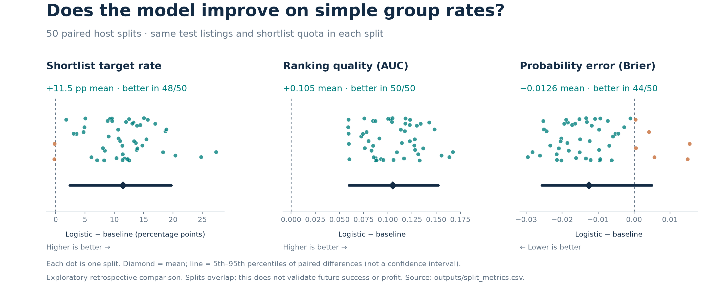

# Final report evidence: paired model comparison

This package records the analysis completed on 2 October 2026. It evaluates the previously chosen six-input logistic model and a segment-rate baseline on the same 50 host splits. It also reproduces the separate five-fold result after correcting missing-value handling.

The publication contains code, configuration, aggregate results and figures. Authorised private inputs are required for a complete model rerun; they are deliberately excluded.

## Results

Across 50 repeated host splits, the logistic model found an average of about 11 to 12 additional target-reaching listings per 100 shortlisted, compared with the segment-rate baseline. Both methods used the same test listings and the same shortlist quota within each split. This is a retrospective screening comparison, not a prediction of future occupancy or profit.

| Metric: equal-weight mean across 50 splits | Logistic | Segment baseline | Mean paired difference: logistic minus baseline | Logistic better |
|---|---:|---:|---:|---:|
| Shortlist precision | 43.42% | 31.96% | +11.46 percentage points | 48/50 splits |
| AUC | 0.7084 | 0.6035 | +0.1049 | 50/50 splits |
| Brier score, lower is better | 0.17151 | 0.18406 | -0.01256 | 44/50 splits |

| Paired difference | 5th to 95th percentiles | Full observed range | Better / tied / worse splits |
|---|---:|---:|---:|
| Precision, percentage points | +2.37 to +19.72 | -0.23 to +27.36 | 48 / 0 / 2 |
| AUC | +0.0596 to +0.1523 | +0.0591 to +0.1673 | 50 / 0 / 0 |
| Brier score | -0.02575 to +0.00501 | -0.02954 to +0.01547 | 44 / 0 / 6 |

These percentile ranges describe sensitivity to the allocation of hosts. They are **not confidence intervals**. The splits overlap and reuse the same observations; they are not 50 independent tests. Probability error and shortlist precision did not improve in every split. Exact values are in [paired_summary.csv](outputs/paired_summary.csv).



## What changed

Each repeated split now fits both methods to the same training hosts and compares them on the same held-out hosts. Precision, AUC, Brier score and within-split differences are all recorded. The baseline is the training outcome rate for the full area/type/bedroom segment, with fixed smoothing weight 10; it is not a second logistic model using only those three characteristics.

The three missing minimum-stay values remain missing until a training/test split is formed. The observed values are first converted to a binary one-night indicator. Each split learns the observed binary mode from its training listings alone and applies that mode to missing training and test values. An exact tie resolves to No. Segment price medians, baseline rates and model coefficients are also learned from training data alone. All 55 realised training sets learned No; no unseen-segment fallback was needed. The corrected predictions therefore agree with the earlier stored predictions up to floating-point differences. The implementation does not force this agreement.

The one-night definition itself was selected after earlier outcome inspection showed no positive outcome in the former seven-or-more-night category. This outcome-informed choice was frozen for the rerun, not selected again within each training set. The results are consequently an **internal sensitivity check of a previously explored specification**, not nested model selection or an untouched-test evaluation. Earlier nested selection assessed a different process and does not validate this revised specification.

## Relationship to the five-fold presentation result

The separate pooled five-fold result is **423/969 = 43.65% versus 28.07%, a difference of 15.58 percentage points**. The mean over the 50 repeated 70/30 host splits is **43.42% versus 31.96%, a difference of 11.46 percentage points**. They use different training/test sizes, training samples and quota allocation; they are different statistics and must be labelled separately. The 50 repeated test sets must not be pooled as though their observations were independent.

This rerun covers the full eligible population of 3,873 listings from 1,726 hosts. It does not newly evaluate gains within the three recommended business segments. It also does not rerun the earlier random-forest comparison or nested-selection workflow, and cannot establish that logistic regression outperforms random forest.

## Evidence and verification

| File | Purpose |
|---|---|
| [paired_summary.csv](outputs/paired_summary.csv) | Main paired result, including mean, median, percentiles, range and better/tied/worse counts |
| [split_metrics.csv](outputs/split_metrics.csv) | All metrics for five host folds and 50 repeated splits; select `design == repeated_host_split` for the latter |
| [preprocessing_audit.csv](outputs/preprocessing_audit.csv) | Training binary counts, learned fill, missingness and unseen-segment counts |
| [five_fold_pooled_comparison.csv](outputs/five_fold_pooled_comparison.csv) | Separate reproduction of the pooled five-fold result |
| [change_from_published.json](outputs/change_from_published.json) | Effect of corrected preprocessing on the saved earlier results |
| [split_coefficients.csv](outputs/split_coefficients.csv) | Each training model's coefficients for score reconstruction |
| [full_descriptive_coefficients.csv](outputs/full_descriptive_coefficients.csv) | Full-sample descriptive fit and host-clustered intervals, conditional on the chosen specification |
| [verification.json](outputs/verification.json) | Saved independent Python verification record and checked-file hashes |
| [helper_tests.json](outputs/helper_tests.json) | Fourteen preprocessing, boundary and quota checks |
| [rerun_plan.json](config/rerun_plan.json) | Rules frozen for this rerun, not preregistration of the earlier model choice |
| [METHODS_FOR_REPORT.md](METHODS_FOR_REPORT.md) | Detailed method, interpretation and research-history disclosure |

The independent checker rebuilt training medians, binary imputation, baseline scores and 63,093 test-row logistic scores from the private compact input and exported coefficients. The maximum logistic-score discrepancy was 3.50 x 10^-15. It separately recomputed split metrics and paired summaries. It **did not refit logistic regression**, independently rebuild the dated-review outcome from raw data, or replay R's random-number generator in Python. It checked original fold assignments, complete disjoint host memberships, counts and declared repeated-split seeds. The saved verification record was generated in the authorised analysis environment; an aggregate-only checkout cannot recreate those private-data checks.

## Provenance

The source release commit is `2ac211dca5337f5b6d17ccf913d9d12ee668811e`; its historical analysis base is `7ea295c50999472bc91b5f247e75a187b4171545`. The authorised input and earlier out-of-fold prediction fingerprints are recorded in [provenance.json](reference/provenance.json):

- `analysis_input.csv`: SHA-256 `bf286ed7bfb89a3e06f7a52e10c3913507296e62432a56596b24fef88a6dee20`.
- `legacy_oof_predictions_PRIVATE.csv`: SHA-256 `97330f63b87ec994f457801fa7aab8ae4e8472b86344559b447c92dc459e7725`.

The model and aggregate numerical files are unchanged by publication preparation. Documentation was converted to portable English, the runner gained an input preflight, the archive builder gained a file-by-file allowlist, and machine-specific library paths were removed from the copied runtime note. These packaging changes do not alter the analysis.

## Reproduction

### Public files

Review the saved CSV/JSON results directly. Validate the publication allowlist, CSV privacy schema and, when present, manifest hashes without private data:

```sh
python3 scripts/package_results.py --check
```

This publication check verifies file integrity and scope only. It does not recreate model fits, predictions or statistics from listing records. To create or refresh the manifest, run `python3 scripts/package_results.py`; add `--archive` to produce a ZIP containing only the explicit allowlist and manifest.

Optional figure regeneration uses the saved aggregate tables, requires `matplotlib` and `numpy`, and does not fit models:

```sh
python3 scripts/plot_paired_results.py
```

### Authorised complete model rerun

Restore the two matching private files as `private-inputs/analysis_input.csv` and `private-inputs/legacy_oof_predictions_PRIVATE.csv`, checking their hashes against `reference/provenance.json`. These are existing authorised processed inputs, not publicly supplied data. Creating the compact input from raw dated reviews requires the source repository's separate cleaning and review-window pipeline; this package does not implement that raw rebuild.

Install R packages `data.table`, `jsonlite` and `sandwich`, and use Python 3 for the standard-library verifier. The recorded environment was R 4.5.3, data.table 1.17.8, jsonlite 2.0.0 and sandwich 3.1-1; see [R_session_info.txt](reference/R_session_info.txt).

```sh
bash run.sh
```

The runner stops before changing saved outputs if private inputs are absent or their hashes differ. A successful run checks the helpers, fits the paired models, writes private memberships and predictions, and runs the independent verifier. `REPORT_PYTHON_BIN` may select a different Python executable. Private inputs, working files, raw logs and row-level identifiers are excluded from publication by both `.gitignore` and the file allowlist. Keep regenerated private material local.
